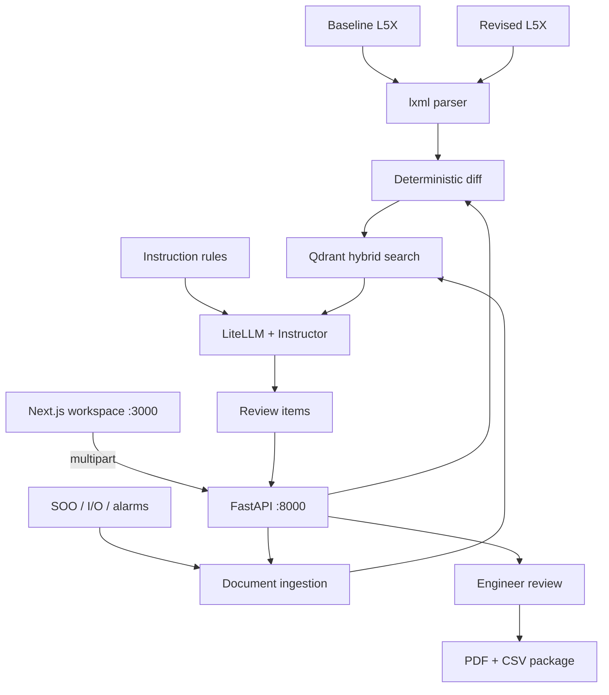

# Evidra

**Every change, proven before production.**

A read-only release-assurance workspace for Rockwell Studio 5000 projects. Evidra compares a baseline L5X export with a revised export, ties behavioral changes to governing documents (sequence of operations, I/O lists, alarm lists), and produces evidence-backed regression tests for a controls engineer to confirm, dismiss, or send back for investigation. The product is used before Factory Acceptance Testing. It never connects to a live controller and never approves a release on its own.

Deterministic work comes first. Ladder and tag differences are computed in Python. The language model is only asked to map a change to a requirement and draft a test, and every model reply must validate against a Pydantic schema before it can reach the review screen.

---

## 1. System Architecture

The browser never calls a model provider. Next.js talks to FastAPI. FastAPI parses the uploads, diffs the controller exports, and (on the benchmark path) asks Qdrant and the configured LLM for mappings and test plans.



| Stage | What it does | Where it lives |
| --- | --- | --- |
| **Parse** | Reads a Studio 5000 L5X export into programs, routines, rungs, and tags. Strips export metadata (`ExportDate`, `ToolID`, `Owner`, revisions) so a re-export is not a false change. | `backend/app/services/lxml_parser.py` |
| **Diff** | Compares baseline and revised trees. Emits added, removed, and modified tags, rungs, routines, and programs, each labeled with a change class. | `backend/app/services/diff_engine.py` |
| **Ingest** | Extracts text from governing PDFs, DOCX, XLSX, and CSV into citable blocks (document, revision, page, section). | `backend/app/services/ingestion.py`, `doc_parser.py` |
| **Map** | Indexes PLC tag names and requirement chunks in Qdrant. Dense embeddings plus local BM25, fused with reciprocal rank fusion. | `backend/app/ai/qdrant_engine.py` |
| **Reason** | Drafts a constrained finding and a regression test. Instructor rejects any reply that does not match the schema. | `backend/app/ai/llm_generator.py` |
| **Rules** | Applies deterministic meanings for Rockwell instructions (`AFI`, `XIC`, `XIO`, `TON`, `MOV`, and others). Severity is not left to the model. | `backend/app/services/rules.py` |
| **API** | Multipart analyze, curated demo findings, and single-test generation. | `backend/app/api/routes.py` |
| **Review** | Side-by-side logic, requirement citation, test plan, and Confirm / Dismiss / Needs Investigation. | `frontend/src/components/review/` |
| **Export** | Human-reviewed package as PDF and CSV, built in the browser. | `frontend/src/lib/export.ts` |

The live `POST /api/v1/analyze` route always parses both L5X files, runs the deterministic diff, and ingests the uploaded documents. While `YC_DEMO_CURATED_FINDINGS` is `true` (the default), the response then returns three curated DC1 behavioral findings, with `changes_analyzed` taken from the real diff. The benchmark script in section 9 is the path that runs hybrid mapping and LLM generation against `sample_data/ground_truth.json`.

---

## 2. Tech Stack & Justifications

| Layer | Technology | Why |
| --- | --- | --- |
| **L5X parsing** | **lxml** | Studio 5000 exports are XML. A real parser beats regex on rungs, tags, and comments, and it can ignore export noise before the diff. |
| **Document parsing** | **pdfplumber**, **python-docx**, **openpyxl**, **pandas** | SOO/FDS arrives as PDF or DOCX. I/O and alarm lists arrive as spreadsheets. All four stay on the machine that runs the API. |
| **Vector search** | **Qdrant** + **FastEmbed BM25** | Hybrid search: dense vectors for requirement intent, sparse BM25 for exact tag names (`P101`, `CHWP_01`). Reciprocal rank fusion combines the two lists. |
| **Embeddings** | **Voyage `voyage-4-lite`** (default), or OpenAI, Gemini, or local **BAAI/bge-small-en-v1.5** | Anthropic has no embeddings API. Voyage is the paired dense model (1024-d). Local FastEmbed (384-d) is the air-gapped option. |
| **LLM router** | **LiteLLM** | One call site for Anthropic, OpenAI, Gemini, Ollama, and vLLM. Provider and model ids come from `.env`. |
| **Schema enforcement** | **Instructor** + **Pydantic v2** | The model must return a finding and a test plan. Malformed JSON never reaches the UI. |
| **Dual models** | Fast model + reasoning model | Haiku-class models handle light drafts. The reasoning model (`LLM_REASONING_MODEL`) fills `StrictFindingSchema`. |
| **Backend** | **FastAPI** + **Uvicorn** | Multipart uploads, OpenAPI at `/docs`, typed response models. |
| **Frontend** | **Next.js 14** (App Router) + **React 18** + **Tailwind** + **shadcn/ui** | Landing page, login, engineer workspace, and an unlisted admin portal. |
| **Client state** | **Zustand** | Review items, dispositions, and the upload session live in the browser until export. |
| **Auth store** | **`users.csv`**, or the same file in **Azure Blob** | Admin creates engineer, reviewer, and viewer accounts. There is no public signup. |
| **Export** | **jsPDF** + **Papa Parse** | The reviewed package is generated in the browser: one PDF, one CSV. |
| **Python env** | **uv** | Dependencies are locked in `pyproject.toml` and `uv.lock`. |
| **Deploy** | **Docker** + **Azure Container Apps** | `scripts/deploy-azure.ps1` builds both images locally and updates the container apps. |

---

## 3. Finding Schema

Every review row is a `ReviewItem`. The model may fill a `ConstrainedFinding` (alias `StrictFindingSchema`). Python and the reviewer own status, disposition, and the final export.

### Classifications shown in the UI

Only these three labels appear on a finding. Older change-class names stay inside the pipeline and are not shown as the classification.

| Classification | Meaning |
| --- | --- |
| `Approved change` | The revised logic still matches the cited requirement. |
| `Suspected regression` | The revised logic is likely to fail the cited requirement at FAT. |
| `Needs review` | The evidence is incomplete or the mapping is ambiguous. |

### Engineering disposition

| Value | Reviewer action in the UI |
| --- | --- |
| `CONFIRM FINDING` | Confirm Finding (`Accepted`) |
| `DISMISS` | Dismiss Finding (`Rejected`) |
| `NEEDS INVESTIGATION` | Needs Investigation |

### Five behavioral fields

The reasoning model must populate all five. High-confidence text has to come from the parsed rung or tag and from a cited document block.

| Field | What it states |
| --- | --- |
| `required_behavior` | What the SOO or FDS says must happen. |
| `verified_code_change` | The exact instruction or tag that changed. |
| `predicted_revised_behavior` | What the revised logic is likely to do, from the instruction rules. |
| `test_pass_condition` | The observation that makes the regression test pass. |
| `predicted_test_outcome` | `PASS`, `FAIL`, or `UNKNOWN`. |

Uncertainty is one of `Verified`, `High confidence`, `Probable`, or `Unknown`. Severity is `Critical`, `High`, `Medium`, or `Low`.

### Change classes (pipeline)

The diff engine labels each behavioral change with one class. These drive test category, not the badge on the card.

| Class | Typical evidence |
| --- | --- |
| `Interlocks` | Permissives, `XIC` / `XIO` / `AFI` on a start or trip rung |
| `Alarms/Timers` | Alarm setpoints, `TON` presets |
| `Modes` | Hand / Off / Auto, lead / lag, enable bits |
| `Sequences` | Step logic, transitions, equipment order |

### Regression test

`RegressionTestSchema` is the test attached to a finding. Instructor validates it before the API returns. A test carries `test_id`, `title`, `affected_equipment`, `category`, `related_tags`, `governing_requirement`, ordered `steps` (`action` plus optional `observation`), `expected_result`, and prerequisites. Prerequisites must name simulation or an approved FAT environment. A step list that would send someone to a live field PLC is rejected.

A condensed wire example:

```json
{
  "id": "REV-001",
  "classification": "Suspected regression",
  "severity": "Critical",
  "location": "Program MainProgram / Routine Failover / Rung 4",
  "requirement_id": "SOO-4.2",
  "requirement_text": "On lead-pump fault, the standby pump shall start automatically.",
  "soo_page_or_section": "SOO Rev B, §4.2",
  "required_behavior": "Standby pump starts when the lead pump faults.",
  "verified_code_change": "AFI inserted ahead of the standby-start OTE.",
  "predicted_revised_behavior": "The standby start path is forced false.",
  "test_pass_condition": "Standby pump starts within the SOO time limit.",
  "predicted_test_outcome": "FAIL",
  "engineering_disposition": "NEEDS INVESTIGATION",
  "uncertainty": "High confidence"
}
```

---

## 4. Repository Layout

```
.
├── backend/
│   ├── app/
│   │   ├── main.py              # FastAPI entry
│   │   ├── api/routes.py        # /health, /analyze, /mock-findings, /generate-test
│   │   ├── core/config.py       # pydantic-settings (.env)
│   │   ├── schemas/             # change, finding, mapping, review, test models
│   │   ├── services/            # parse, diff, ingest, rules, pipeline
│   │   └── ai/                  # Qdrant hybrid search, LiteLLM + Instructor
│   ├── tests/                   # ingestion, diff, mapping, generation, benchmark
│   └── Dockerfile
├── frontend/
│   ├── src/app/                 # landing, /login, /dashboard, /admin
│   ├── src/components/review/   # diff pane, test plan, disposition
│   ├── src/lib/                 # API client, users.csv auth, PDF/CSV export
│   ├── data/users.csv           # local engineer accounts (gitignored contents)
│   └── Dockerfile
├── sample_data/                 # DC1 cooling benchmark (L5X, SOO, ground truth)
├── scripts/deploy-azure.ps1     # local Docker build → Azure Container Apps
├── .env.example
└── pyproject.toml
```

`sample_data/` is the synthetic DC1 cooling package used by the benchmark: baseline and revised L5X, SOO (PDF and DOCX), I/O list, alarm list, expected findings, and `ground_truth.json`. `data-use-case/` holds larger multi-industry packages (data center, mining, oil and gas, pharma, legacy brownfield) and is not required to run the app.

---

## 5. Prerequisites

- **Windows** with **PowerShell** (the deploy script is PowerShell; the app itself is a normal Python + Node monorepo)
- **Python 3.11+** and **[uv](https://docs.astral.sh/uv/)**
- **Node.js 18+** and npm
- **Qdrant** on `http://localhost:6333`, a Qdrant Cloud URL, or `QDRANT_IN_MEMORY=true`
- **An API key for the provider you select.** The default pair is `ANTHROPIC_API_KEY` plus `VOYAGE_API_KEY`. OpenAI or Gemini can stand in for both roles. Local Ollama needs neither.
- **Docker Desktop** (Linux containers) and **Azure CLI** (`az login`), only for section 10

```powershell
git clone <your-repo-url>
cd AI-Automation
copy .env.example .env
uv sync
```

Edit `.env` before the first analyze or benchmark run. At minimum set the keys for `LLM_PROVIDER` and `EMBEDDING_PROVIDER`. Never commit `.env`.

Local Qdrant, if you are not using Cloud or the in-memory client:

```powershell
docker run -d --name evidra-qdrant -p 6333:6333 qdrant/qdrant
```

Install the frontend once:

```powershell
cd frontend
copy .env.example .env.local
npm install
cd ..
```

`NEXT_PUBLIC_API_URL` defaults to `http://127.0.0.1:8000`. On Windows, prefer `127.0.0.1` over `localhost` so the browser does not hit a different process bound to the IPv6 localhost address.

---

## 6. Analysis Pipeline

`run_analysis_pipeline` in `backend/app/services/pipeline.py` is the orchestrator behind `POST /api/v1/analyze`.

### A. Inputs

| File | Required | Accepted types |
| --- | --- | --- |
| Baseline controller export | Yes | `.L5X`, `.xml` |
| Revised controller export | Yes | `.L5X`, `.xml` |
| Governing documents | At least one | `.pdf`, `.docx`, `.xlsx`, `.xls`, `.csv` |

A ready set lives in `sample_data/`:

- `DC1_Cooling_Baseline_RevA.L5X`
- `DC1_Cooling_Revised_RevB.L5X`
- `DC1_Cooling_SOO_RevB.pdf` (or the `.docx`)
- `DC1_Cooling_IO_List_RevB.xlsx`
- `DC1_Cooling_Alarm_List_RevB.xlsx`

### B. What the API does with an upload

1. Save the uploads to a temporary directory and delete them when the request finishes.
2. Parse both L5X files.
3. Diff them. Export metadata and whitespace-only edits are ignored.
4. Ingest every governing document into citable blocks.
5. With the demo flag on, return the three curated DC1 findings. `changes_analyzed`, controller name, and filenames come from the files you uploaded.
6. With the demo flag off, the route currently refuses to invent a full finding list. That enumeration is what section 9 scores offline.

```powershell
# Default. Three curated findings, real diff counts.
$env:YC_DEMO_CURATED_FINDINGS = "true"
```

### C. Benchmark path (mapping + generation)

`backend/tests/test_benchmark.py` runs the full offline pipeline against `sample_data/` and writes `sample_data/VALIDATION_REPORT.md`. Gates:

| Gate | Target |
| --- | --- |
| End-to-end time | under 10 minutes |
| Deterministic diff, run twice | 100% reproducibility |
| Mapping precision@1 | at least 80% |
| Mapping recall@3 | at least 80% |

### D. Single test generation

`POST /api/v1/generate-test` takes a structured change plus a candidate requirement and returns one `RegressionTestSchema`. This is the call the reasoning model serves. It does not approve the release.

---

## 7. Run the Application

Two processes: FastAPI, then Next.js. Start Qdrant first when `QDRANT_IN_MEMORY` is false and `QDRANT_URL` points at localhost.

### A. FastAPI backend

From the repository root, with `.env` in place:

```powershell
uv run uvicorn app.main:app --app-dir backend --reload --host 127.0.0.1 --port 8000
```

| URL | What you should see |
| --- | --- |
| [http://127.0.0.1:8000/api/v1/health](http://127.0.0.1:8000/api/v1/health) | `{"status":"ok","service":"release-assurance-backend"}` |
| [http://127.0.0.1:8000/docs](http://127.0.0.1:8000/docs) | OpenAPI UI for analyze, mock findings, and generate-test |
| [http://127.0.0.1:8000/api/v1/mock-findings](http://127.0.0.1:8000/api/v1/mock-findings) | The three curated DC1 findings, no upload required |

`POST /api/v1/analyze` accepts multipart form data:

- `baseline_l5x` — baseline `.L5X`
- `revised_l5x` — revised `.L5X`
- `governing_docs` — one or more PDF, DOCX, XLSX, or CSV files

CORS allows `http://localhost:3000` and `http://127.0.0.1:3000`, plus any origin in `CORS_ORIGINS`.

### B. Frontend

```powershell
cd frontend
npm run dev
```

| URL | Page |
| --- | --- |
| [http://localhost:3000](http://localhost:3000) | Landing page |
| [http://localhost:3000/login](http://localhost:3000/login) | Engineer sign-in, then `/dashboard` |
| [http://localhost:3000/admin/login](http://localhost:3000/admin/login) | Admin portal (not linked from the public UI) |

Admin credentials are `ADMIN_USERNAME` and `ADMIN_PASSWORD` in `frontend/.env.local`. They default to the values in `.env.example`. Change them before any shared deploy.

### C. Use the workspace

1. Open `/admin/login` and create an engineer account. There is no default engineer user. Accounts are rows in `frontend/data/users.csv` (or the Azure blob of that file when deployed).
2. Sign in at `/login`.
3. Upload the baseline L5X, the revised L5X, and at least one governing document. The DC1 files in `sample_data/` are a known-good set.
4. Click **Run Analysis**.
5. Review each finding. **Confirm Finding**, **Dismiss Finding**, or **Needs Investigation**. The diff pane shows baseline and revised logic. The test pane shows steps and the expected result.
6. Export the package. The browser downloads a PDF and a CSV named with the review date.

**Load sample review** on the upload screen skips the API and opens the curated findings, for UI walkthroughs when the backend is down.

---

## 8. Optional: Local LLM (Ollama)

Use this when the API and the benchmark should call a model on the same machine. Embeddings can stay on FastEmbed so no cloud key is required.

```powershell
ollama pull llama3.1
ollama serve
```

In the root `.env`:

```env
LLM_PROVIDER=ollama
LLM_MODEL_NAME=llama3.1
LLM_REASONING_MODEL=llama3.1
LLM_API_BASE=http://localhost:11434
EMBEDDING_PROVIDER=local
EMBEDDING_MODEL_NAME=BAAI/bge-small-en-v1.5
QDRANT_URL=http://localhost:6333
```

Restart the backend after changing `.env`. `uv` does not need a separate training environment. Ollama is only an inference server.

vLLM uses the same shape with `LLM_PROVIDER=vllm` and `LLM_API_BASE` pointed at the server's OpenAI-compatible URL.

---

## 9. Validation

Run from the repository root after `uv sync`. Qdrant must be reachable unless the test only touches the diff.

```powershell
uv run python backend/tests/test_ingestion.py
uv run python backend/tests/test_diff.py
uv run python backend/tests/test_mapping.py
uv run python backend/tests/test_generation.py
uv run python backend/tests/test_benchmark.py
```

Benchmark switches:

```powershell
# Diff + mapping only. Skips the generation stage.
$env:BENCHMARK_SKIP_LLM = "1"
uv run python backend/tests/test_benchmark.py

# Cap how many findings are sent to the model.
$env:BENCHMARK_LLM_LIMIT = "4"
uv run python backend/tests/test_benchmark.py
```

The benchmark writes `sample_data/VALIDATION_REPORT.md`.

---

## 10. Azure Deployment

One command from the repository root. The script builds both images on your machine, pushes them to Azure Container Registry, and creates or updates two Container Apps. It does not use ACR Tasks.

```powershell
powershell -ExecutionPolicy Bypass -File .\scripts\deploy-azure.ps1
```

| Switch | Effect |
| --- | --- |
| `-BackendOnly` | Build and update the API app only |
| `-FrontendOnly` | Build and update the Next.js app only |
| `-SubscriptionId "<id>"` | Target a specific subscription |

What the script does:

1. Registers Azure resource providers if they are missing.
2. Builds and pushes the backend image (`backend/Dockerfile`) and the frontend image (`frontend/Dockerfile`).
3. Creates or updates the Container Apps environment and the two apps.
4. Copies API keys, LLM settings, embedding settings, and Qdrant settings from the root `.env` onto the backend app.
5. Sets the frontend `NEXT_PUBLIC_API_URL` to the backend URL, copies `ADMIN_USERNAME` / `ADMIN_PASSWORD`, and creates a storage account so every replica shares one `users.csv` blob.
6. Writes the URLs to `deploy-output.txt`.

Before you run it: Docker Desktop is running with Linux containers, `az login` has succeeded, and the root `.env` contains the provider keys plus admin credentials.

```powershell
Get-Content .\deploy-output.txt
```

- Open **FrontendUrl** for the landing page.
- Create users in the admin portal, then sign in at `/login`.
- Admin portal: `https://<FrontendUrl>/admin/login`
- Backend health: `https://<BackendUrl>/api/v1/health`

Manual image builds, if you are not using the script:

```powershell
docker build -f backend/Dockerfile -t evidra-api .

docker build -f frontend/Dockerfile `
  --build-arg NEXT_PUBLIC_API_URL=https://your-api.azurecontainerapps.io `
  -t evidra-web ./frontend
```

Default Azure names are resource group `rg-release-assurance`, environment `cae-release-assurance`, backend `ca-release-assurance-api`, and frontend `ca-release-assurance-web`, in `eastus`. Override them with the script parameters.

---

## 11. Environment Variables

Copy `.env.example` to `.env`. The frontend has its own file.

**Repository root `.env`** (read by FastAPI and by the deploy script):

```env
ANTHROPIC_API_KEY=your_anthropic_key
VOYAGE_API_KEY=your_voyage_key
OPENAI_API_KEY=your_openai_key
GEMINI_API_KEY=your_gemini_key

ADMIN_USERNAME=admin
ADMIN_PASSWORD=your-strong-password

QDRANT_URL=http://localhost:6333
QDRANT_API_KEY=
QDRANT_IN_MEMORY=false

EMBEDDING_PROVIDER=voyage
EMBEDDING_MODEL_NAME=voyage-4-lite

LLM_PROVIDER=anthropic
LLM_MODEL_NAME=anthropic/claude-3-5-haiku-20241022
LLM_REASONING_MODEL=anthropic/claude-3-5-sonnet-20240620

LLM_TEMPERATURE=0.1
LLM_MAX_TOKENS=2048
CORS_ORIGINS=http://localhost:3000,http://127.0.0.1:3000
```

| Variable | Role |
| --- | --- |
| `LLM_PROVIDER` | `anthropic` (default), `openai`, `gemini`, `ollama`, `vllm`, or `local`. If Anthropic is selected and the key is empty, config falls forward to OpenAI, then Gemini, when those keys exist. |
| `LLM_MODEL_NAME` | Fast model. Default `anthropic/claude-3-5-haiku-20241022`. |
| `LLM_REASONING_MODEL` | Model that fills `StrictFindingSchema`. Default `anthropic/claude-3-5-sonnet-20240620`. |
| `LLM_API_BASE` | Required for Ollama (`http://localhost:11434`) and vLLM. Leave empty for Anthropic, OpenAI, and Gemini. |
| `EMBEDDING_PROVIDER` | `voyage` (default), `openai`, `gemini`, or `local`. Voyage without `VOYAGE_API_KEY` falls forward to OpenAI when that key exists. |
| `EMBEDDING_MODEL_NAME` | `voyage-4-lite`, `text-embedding-3-small`, `gemini-embedding-001`, or `BAAI/bge-small-en-v1.5`. |
| `EMBEDDING_DIMENSIONS` | Optional Matryoshka size. Voyage 4: 256 / 512 / 1024 / 2048. Gemini defaults to 768 in this app. |
| `QDRANT_URL` / `QDRANT_API_KEY` | Local server or Qdrant Cloud. |
| `QDRANT_IN_MEMORY` | `true` uses an in-process store and ignores the URL. |
| `ADMIN_USERNAME` / `ADMIN_PASSWORD` | Admin portal. The deploy script copies these onto the frontend app. |
| `CORS_ORIGINS` | Extra browser origins, comma-separated. Localhost on port 3000 is always included. |
| `YC_DEMO_CURATED_FINDINGS` | `true` (default) returns the three curated findings after a real diff. |

**`frontend/.env.local`:**

```env
NEXT_PUBLIC_API_URL=http://127.0.0.1:8000
ADMIN_USERNAME=admin
ADMIN_PASSWORD=your-strong-password
```

| Variable | Role |
| --- | --- |
| `NEXT_PUBLIC_API_URL` | Origin of the FastAPI app. Baked in at `next build` for production images. |
| `USERS_CSV_PATH` | Override for the local accounts file. Default `frontend/data/users.csv`. |
| `AZURE_STORAGE_CONNECTION_STRING` | When set, every instance reads and writes the same `users.csv` blob. |
| `USERS_CSV_CONTAINER` / `USERS_CSV_BLOB` | Blob location. Defaults `evidra-auth` / `users.csv`. |

Passwords in `users.csv` are stored in plaintext for this demo. Treat that file as a secret.

---

## 12. Safety Boundaries

Evidra is a review aid for a qualified controls engineer.

- The API only accepts file uploads. It has no path that connects to a controller, an HMI, or a plant network.
- A finding is a hypothesis with cited evidence. Confirm Finding records the engineer's decision. It does not download logic or clear a release.
- Test prerequisites are required to name simulation or an approved FAT environment.
- The model is instructed to use only the parsed change and the supplied requirement. Missing evidence stays `Unknown` or `Needs review` rather than becoming invented logic.
- Exports are produced from the items the reviewer left on screen, including their disposition and notes.
